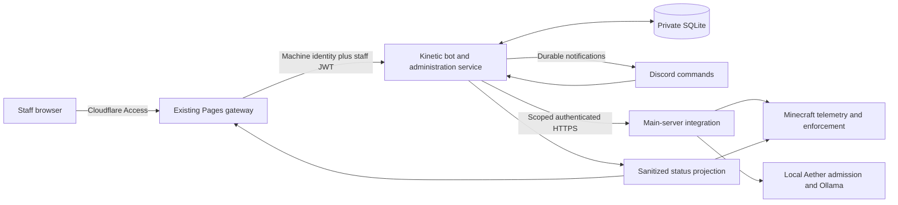

# Wilderness Odyssey connected services and administration assessment

Date: 2026-09-23. Status: proposed design, awaiting owner approval before implementation.

This replaces earlier Discord bot implementation plans where they conflict with this task. It does not authorize service restarts, deployments, DNS changes, command registration, permission changes, data migration, or broader conversation collection.

## 1. Repository assessment

### Evidence and scope

Read-only inspection covered the current `bot` checkout at `656777006a8fcd06ca453b19e8ab555c41c9089e` and the local `website` branch at `35e9e676c656aea618b97af91d0eac249981a709`, including startup, HTTP routes, commands, persistence, identity linking, report routing, tests, website contracts, Access verification, and deployment configuration. Branch files were read without switching the working tree. Remote branches were not refreshed; these are local source snapshots, not proof of production state.

The owner confirmed that Kinetic uses Node 22, that files do not survive reinstall unless preservation is explicitly selected, and that HTTPS reverse proxy support is believed available. No authenticated Kinetic or Cloudflare account configuration was available in this inspection. Live host permissions, port assignments, certificates, Access applications, and deployed revisions remain unverified. The main-server implementation is a separate inspection prerequisite; this document specifies its required boundary without claiming that it already exists.

The goal is a real-world monitoring, support, and administration service, separate from Aether's fictional in-game personality. Existing support functionality and stored records should survive the transition. Implementation must preserve unrelated untracked `.astro/`, `.npm-cache/`, `.wrangler/`, and `test-results/` directories.

### What exists and what should change

| Area | Current source evidence | Decision |
| --- | --- | --- |
| Runtime | `package.json`, `src/index.ts`, root `index.js`: TypeScript/discord.js, Kinetic launcher builds then starts the app | Extend this bot and Discord account. Do not create a second bot. |
| Repository guidance | `AGENTS.md` describes a Vite website and says there are no tests; the checkout is a bot with `check`, `test`, and `build` scripts | Update guidance during implementation; use actual bot scripts and tests. |
| Storage | `src/db.ts:9`: one `node:sqlite` connection, WAL, foreign keys, additive migrations; `src/config.ts:90` sets `DATABASE_PATH` | Reuse the database connection and existing tables; introduce numbered, transactional migrations for new records. |
| Commands | `src/commands/index.ts` registers 18 existing commands plus optional `/aether` | Extend the registry and shared handlers, preserving existing command names. |
| Public status | `src/commands/status.ts:12` says systems are online and displays configured status text | Replace unsupported availability claims with observed, timestamped service state. Configured release version is not proof of the running server version. |
| Aether | `src/aether/providers/index.ts`, `src/aether/config.ts:3`: scripted/disabled providers; `core.ts:206` reports bot-local Aether status | Neither proves remote Ollama connectivity or inference readiness. Remote service monitoring must be independent of the optional local assistant. |
| HTTP | `src/services/minecraftVerificationApi.ts:16`: shared plain-HTTP server, optionally enabled | Reuse the listener/lifecycle; extract routing into a general HTTP module. Make monitoring/admin enablement independent of account verification. |
| Identity risk | `minecraftVerificationApi.ts:71` accepts a code, UUID, and name without service authentication | Harden or disable this path before exposure. Possession of a Discord link code does not establish ownership of an arbitrary Minecraft UUID. |
| Legacy identity trust | `minecraftVerificationRelayService.ts:37` pins a webhook only when configured; link rows lack provenance | Require the exact trusted relay identity during transition. Preserve old rows but require re-verification before relying on uncertain links for moderation. |
| Internal metrics | `/metrics` is unauthenticated when enabled; `metricsService.ts` measures the bot, not Minecraft TPS/MSPT | Protect it separately. Never publish Prometheus output as the public status API. |
| Authorization | `src/utils/permissions.ts:15` treats Administrator, ManageGuild, and ModerateMembers as one staff class | Retain existing support behavior where appropriate, but put every new privileged operation behind explicit backend capabilities and resource checks. |
| Reports | Existing bug/crash/performance intake and forum posting in `reportService.ts` | Reuse structured bug intake. AI moderation reports need private storage and delivery, never the public forum or a GitHub issue path. |
| Background work | `queueService.ts` is an in-memory crash queue; shutdown closes shared resources | Add durable operations and notification delivery. Monitoring must run independently of Discord connection readiness. |
| Existing tests | `test/security.test.ts`, `command-registration.test.ts`, core/router/memory tests | Extend these; their existence is not a claim that they passed in this assessment. |

### Website work already present

The `website` branch already has an Astro site, Pages Functions, an Access-protected staff interface, role/capability schemas, and a Kinetic gateway. Reuse these owners:

- `functions/_middleware.ts`: protection for staff pages/APIs and preview paths.
- `server/access.ts`: signed Access JWT verification, hostname restrictions, human-identity checks.
- `server/gateway.ts`, `server/kinetic-client.ts`: allowlisted API routes, session lookup, CSRF/origin checks, validation, upstream timeouts, and two separate identity assertions.
- `contracts/v1/{status,admin,routes}.ts` and generated `schemas.json`: existing shared contracts.
- `docs/api-integration.md`, `docs/cloudflare-deployment.md`: backend responsibilities and rollout gates.

The website workflow targets Cloudflare Pages through GitHub Actions, with deployments conditional on `ENABLE_PAGES_DEPLOYMENTS`. Its checked-in Wrangler configuration is intentionally unconfigured. The bot branch still contains an old manually triggered GitHub Pages workflow. During implementation, align or retire that obsolete workflow without disturbing the current website deployment owner. Source files do not establish whether the live deployment flag or Access policies are configured.

The requested snake_case public contract differs from the existing camelCase version 1 contract. Introduce public version 2 and keep a version 1 compatibility projection; do not silently break the dashboard. Administration version 1 already covers most requested features and should remain the starting point.

## 2. Hosting feasibility

**Recommendation: retain the Kinetic Node bot and SQLite backend, conditional on verified persistence and a protected HTTPS route.** No additional database service is needed for the first deployment.

| Requirement | Evidence | Remaining acceptance condition |
| --- | --- | --- |
| Node runtime | Owner reports Node 22; bot requires `>=22.5.0` | Record exact patch/startup arguments and prove `node:sqlite` opens a disposable database in staging. Prefer a maintained Node 22 patch supporting SQLite without the old experimental flag. |
| Persistent storage | SQLite already exists; owner says reinstall preservation is opt-in | Select and verify preservation of the configured data directory; verify normal restart persistence separately; backup before every reinstall. Never infer that a default reinstall is safe. |
| HTTPS | Kinetic documents reverse proxy configuration and certificate installation | Confirm this bot instance has the feature, an allocated port, certificate, protected origin path, and correct forwarded headers. |
| Port allocation | Kinetic documents panel-assigned ports | Use the assigned port, not an assumption that `3000` is externally available. |
| Isolation | Bot and game are separate instances | Record provider node/region where available. Separate instances can still fail together. |
| Tunnel | Cloudflare supports outbound Tunnel connectors | Kinetic permission to run/supervise `cloudflared`, usable egress, and origin binding remain unverified. |

Kinetic's published documentation supports the feasibility of [reverse proxying with certificates](https://www.kinetichosting.com/articles/kinetic-panel/basics/how-to-use-a-reverse-proxy) and [port allocation](https://www.kinetichosting.com/articles/kinetic-panel/basics/how-to-open-a-port). Its [bot hosting page](https://www.kinetichosting.com/game-servers/discord) advertises storage, backup slots, and MySQL access, but does not prove this account's configuration or safe reinstall behavior. Node's [22.13 release notes](https://nodejs.org/en/blog/release/v22.13.0) document unflagging SQLite; the package's current version floor alone is insufficient assurance for a flag-free startup.

### Deployment alternatives

1. **Kinetic reverse proxy + SQLite — preferred if verified.** Cloudflare Access protects the administration hostname; the bot independently verifies identities. TLS must protect the route to Kinetic, and the proxy-to-process hop must be local/private or encrypted. Block raw-port bypass where supported; application authentication remains mandatory even on direct requests. Use a distinct public status route/hostname containing only the sanitized projection.
2. **Kinetic + Cloudflare Tunnel + SQLite — transport fallback.** Use if native proxying cannot secure the origin and Kinetic permits the connector. Bind the API privately and publish only explicit routes through the tunnel. [Tunnel uses outbound connections](https://developers.cloudflare.com/cloudflare-one/networks/connectors/cloudflare-tunnel/); it does not itself grant application authorization or guarantee process supervision.
3. **Existing Pages Functions + D1 — fallback if durable storage or secure inbound API is unavailable.** Add D1 to the existing gateway and make it the sole administration/incident/operation authority. The bot and main-server connector use authenticated outbound requests to submit observations, lease work, and acknowledge results. This avoids inbound Kinetic API exposure. It requires a larger backend adaptation and moves private moderation storage to Cloudflare, so select it explicitly rather than maintaining competing SQLite and D1 authorities. [D1 supports SQL storage from Workers and Pages](https://developers.cloudflare.com/d1/). If only local persistence is unavailable and account MySQL is verified durable, managed MySQL is another option, but it adds an async database driver and migration work.

No provider support request, account change, or live connectivity probe was performed. The unresolved hosting facts gate deployment, not the ability to review this design.

## 3. Monitoring and incident architecture



The main-server integration exposes bounded telemetry and approved actions. Prefer an independently supervised small service on that host, reading telemetry from the existing Minecraft/Aether owners. A Minecraft-side adapter publishes actual tick measurements and authenticated player information; do not invent a second simulation or inference authority. If hosting allows only an in-process Minecraft endpoint, a JVM crash removes that endpoint: the bot must continue and classify the resulting evidence conservatively. Independently controlled restart operations then remain unsupported until a suitable local supervisor exists.

### Measurements

- Minecraft: network reachability plus authenticated running/tick state; current and maximum player counts; actual measured TPS and mean MSPT over a stated interval; running Minecraft/modpack versions. A normal server-list ping is supplementary evidence only and must never generate TPS/MSPT. Missing metrics stay null.
- Ollama: local connectivity, model residency/readiness, bounded generation result, and Aether admission state are separate observations. A list of [running models](https://docs.ollama.com/api/ps) is not proof that a request can complete.
- Inference: prefer recent aggregate production success/failure counts with no prompt or answer retention. When no recent success exists, run one low-priority, fixed synthetic request through the actual Aether admission path at a bounded interval. Record total elapsed response latency, timeout/overload category, and completion, then discard generated text. Ollama's [generation API](https://docs.ollama.com/api/generate) includes completion and duration fields; convert nanoseconds to milliseconds if those durations are used, and distinguish them from end-to-end request latency.
- Never start health generation from `/status`, a website refresh, or a public HTTP request. Skip probes during intentional pauses and capacity pressure; a skipped probe is not a failure. A recent real response may establish readiness without an extra probe.
- Record observation time, source sample time, boot ID, sequence, and metric window privately. Reject malformed, out-of-order, implausibly future, and replayed observations. Use monotonic time for local deadlines.

### Proposed defaults, configurable and subject to staging calibration

| Setting | Initial value |
| --- | --- |
| Health/telemetry interval | 30 seconds, 10% jitter, at most one in-flight check per source |
| Health HTTP timeout | 5 seconds, response capped at 64 KiB, no redirects |
| Synthetic inference check | At most every 120 seconds if needed; one in-flight request; 15-second deadline; small fixed output bound |
| Confirm failure / recovery | 3 consecutive eligible failures / 2 consecutive eligible successes |
| Telemetry freshness | 120 seconds; inference readiness evidence 180 seconds |
| Severe Minecraft performance | TPS below 15 or mean MSPT above 80 for 3 consecutive complete 60-second windows |
| Performance recovery | TPS at least 18 and mean MSPT below 55 for 3 complete windows |
| Inference incident | 3 consecutive completed failed checks, or at least 50% failures among at least 10 requests in a rolling 5-minute window |
| Overload incident | Admission rejects/capacity saturation sustained for 3 health intervals; classify degraded |
| Retries | Bounded exponential backoff with jitter; dependency-specific circuit breaker; do not replay writes without operation identity |

Do not count repeated reads of one telemetry window as multiple failures. Idle servers without inference observations remain unknown unless a valid readiness check succeeds. Cold model loading is starting/degraded during a bounded grace period, then assessed by actual completion evidence. Health endpoints themselves must remain cheap under overload.

### State and notification rules

Internal states: healthy, suspect, confirmed incident, recovering, resolved. Each component/cause has at most one active incident. Persist counters, evidence times, incident transitions, maintenance windows, and delivery records. After a monitoring gap/restart, retain existing incidents but reset consecutive-observation streaks that crossed the gap; never claim recovery until fresh qualifying successes arrive.

`online` means fresh positive evidence. `degraded` means fresh evidence of impaired service. `offline` requires confirmed unavailability, such as a responsive authenticated host adapter reporting a stopped service, corroborated by a failed game check. `unknown` covers missing/stale/invalid evidence, failed authentication, or an ambiguous collector/network outage. One failed ping is not a confirmed crash. Staff receive a distinct monitoring/authentication fault after threshold; public copy must not misrepresent it as a confirmed Minecraft or Ollama outage.

Maintenance is a persisted, time-bounded overlay for selected components, with the raw observed state retained privately. Continue checks, suppress expected outage/recovery announcements for affected components, and still alert staff about failures outside the scope or beyond the end time. Beginning maintenance does not silently resolve an earlier unexpected incident. Ending maintenance begins a fresh confirmation sequence. Pause/resume is separate from maintenance; intentional pause displays degraded with `requests_paused=true`, or maintenance if covered by an active window.

Write an incident transition and its notification outbox rows in one database transaction. Uniqueness is `(incident_id, transition_version, audience, channel_id)`. Staff receive confirmed outages, repeated inference failures, serious degradation, authentication faults, and recoveries. Public announcements use reviewed templates for confirmed player-impacting outages and recoveries only; they contain no diagnostics or staff notes. Aggregate correlated main-host failures into one public incident and avoid separate Ollama/inference spam when the same failure explains both.

Persist Discord message IDs, delivery attempts, next attempt time, and rate-limit backoff. On an uncertain send outcome, reconcile the deterministic incident/event marker in the target channel before retrying. Discord and SQLite do not share a transaction: describe this as restart-safe deduplication with reconciliation, not guaranteed exactly-once delivery. Coalesce obsolete pending updates after a long Discord outage rather than sending a historical flood. Disable arbitrary mentions; any staff-role ping uses a configured allowlist.

Monitoring starts before Discord login and continues during gateway disconnects. Bot restarts, database unavailability, queue size, event-loop lag, last successful checks, and outbox age appear in protected diagnostics. A monitor cannot announce its own total host failure; an external heartbeat monitor outside the shared Kinetic failure domain is recommended for that condition. Consumers independently age public data to unknown even if no external alert service is configured.

## 4. Public status API contract

### Version and routing

Canonical bot endpoint: `GET /v2/public/status`. Website endpoint: `GET /api/public/v2/status`. Minecraft consumes the same version 2 schema asynchronously, with a short timeout, bounded cache, and no dependency on it for tick/gameplay progress.

Use `schema_version: "2.0"`; the version starts at 2 because a different version 1 already exists in the website. Maintain a separate `GET /v1/public/status` projection for the existing configurable `PUBLIC_STATUS_URL` and `/api/public/v1/status` gateway until both consumers migrate. Keep `/v1/admin/overview.status` in its existing version 1 shape during that period. Generate both from one sanitized observation model.

Version 1 mapping retains its names and enums. Map maintenance to its maintenance object and a conservative component state, not an invented online state. Preserve measured latency distributions only when available; never fabricate p50/p95 from the version 2 scalar. Announcements are omitted from version 1. Its overall `observedAt` must conservatively age the evidence being displayed; unknown values carry no stale numeric measurements. Breaking changes require a new URL major version.

### Version 2 example — illustrative data, not a live reading

```json
{
  "schema_version": "2.0",
  "generated_at": "2026-09-23T16:00:00Z",
  "stale_after_seconds": 120,
  "minecraft": {
    "status": "online",
    "checked_at": "2026-09-23T15:59:58Z",
    "players_online": 8,
    "players_max": 40,
    "tps": 19.9,
    "mspt": 27.4,
    "minecraft_version": "1.21.1",
    "modpack_version": "example-version"
  },
  "aether": {
    "status": "online",
    "checked_at": "2026-09-23T15:59:59Z",
    "ollama_reachable": true,
    "inference_available": true,
    "latency_ms": 850,
    "requests_paused": false
  },
  "maintenance": {
    "active": false,
    "affected_components": [],
    "message": "",
    "starts_at": null,
    "ends_at": null
  },
  "incidents": [],
  "announcements": []
}
```

### Required semantics and limits

| Field | Definition |
| --- | --- |
| `schema_version` | Literal `2.0`. Readers reject unsupported major versions. |
| `generated_at` | UTC RFC3339 timestamp of the committed status snapshot. HTTP requests/caches never refresh this timestamp. |
| `stale_after_seconds` | Integer 15–300, default 120; overall snapshot freshness deadline. |
| Component `status` | Exactly `online`, `degraded`, `offline`, `maintenance`, or `unknown`. |
| Component `checked_at` | UTC timestamp of the latest completed monitoring assessment, or null before any check. Failed checks may advance it only with unknown/unavailable values, never recycled fresh-looking metrics. |
| Player counts | Nonnegative integers or null; max positive when known; no names, samples, UUIDs, or Discord identifiers. Zero means a measured zero. Reject inconsistent online/max pairs. |
| `tps`, `mspt` | Finite number or null; tick-rate bounds follow the supported server's declared tick configuration. For the existing fixed-20-TPS v1 contract use 0–20 TPS. MSPT is mean milliseconds per tick over a complete 60-second window, never ping latency. |
| Version strings | At most 80 characters or null, sourced from running server metadata. |
| Aether booleans | Boolean or null. Reachable does not imply inference available. Intentional pause sets inference availability false, with the pause explicitly shown. |
| `latency_ms` | Finite nonnegative number or null; latest successful bounded readiness request's total elapsed latency. Publish null after its evidence expires. It is not a production percentile. |
| Maintenance | Bounded public message (500 characters); distinct components from `minecraft`, `aether`; UTC start/end or null. `active` is effective at snapshot time. Scheduled/expired windows must not remain active because of a restart. |
| Incidents | Up to 30 public entries: `id`, `component` (`minecraft`, `ollama`, `aether`, `main_server`, `monitoring`), `status` (`investigating`, `identified`, `monitoring`, `resolved`), `summary` (500 characters), and `timestamps` containing `started_at`, `updated_at`, nullable `resolved_at`. Incident workflow status is distinct from service availability status. |
| Announcements | Up to 20 entries: `id`, `title` (180 characters), `message` (2000 characters), `published_at`, optional `url`. HTTPS URLs on approved public domains only; no credentials, internal hosts, or executable markup. Initial publishers are incident/maintenance events, not an unrestricted text mirror. |

All fields in the example are required; nullable values represent missing evidence. IDs use bounded opaque strings. Text is rendered as text, not trusted HTML. Reject non-finite metrics and timestamps more than 60 seconds in the future. The producer drops expired individual measurements even if another component is healthy; successful polls of a stale upstream snapshot do not freshen it.

On expiry, consumers show effective `unknown` and may label retained values explicitly as last known; they must not present cached online status as current. A still-valid maintenance window can be displayed as scheduled maintenance alongside unknown live measurements. Network/API errors also result in unknown, never automatically offline or zero players.

Return JSON only, maximum 64 KiB, projected by an allowlist schema. Use `Cache-Control: public, max-age=15, must-revalidate`; never cache administration responses. Start without a second durable edge cache: bot/API failure may produce a safe 503 and the UI's locally aged last observation. Public GET supports no arbitrary target URL or diagnostic query. Limit traffic at the edge and process; website reads are same-origin. Public CORS, if needed by approved external consumers, permits read-only requests without credentials.

Explicitly exclude private player data, staff identities, internal addresses, logs, prompts, excerpts, model filesystem paths, credentials, and administration operation results. Test the projection with injected extra fields; serialization must not leak them.

## 5. Protected administration API contract

Use the existing website `/api/admin/v1/*` routes, mapping to bot `/v1/admin/*`. Reuse the reviewed field schemas in `website:contracts/v1/admin.ts` and the generated language-neutral schema. Do not copy the website application into the bot branch. Initially vendor the exported schemas with the source revision/checksum and a drift check; keep one canonical contract owner on the website branch. A shared package is unnecessary until release coordination warrants it.

### Endpoint and permission map

The paths below are relative to `/v1/admin`. All require both trusted machine and human identities, current staff assignment, environment binding, and per-record authorization.

| Method and path | Capability / role ceiling | Request or result |
| --- | --- | --- |
| `GET /session` | Active assigned staff | Existing `1.0` session: Access subject, safe display name, role, current capabilities. No bootstrap-on-first-login. |
| `GET /overview` | `status:read` / Viewer+ | Status, recent bounded performance, maintenance/admission revisions, service-operation catalog, authorized operation summaries. |
| `GET /incidents` | `status:read` / Viewer+ | Operational incidents. Internal notes must exclude moderation content and secrets. |
| `PUT /maintenance` | `server:write` / Administrator | Existing `active`, `message`, `startsAt`, `endsAt`, `services`, `reason`, `revision`; validate coherent times/scope. |
| `PUT /ai-requests` | `server:write` / Administrator | `paused`, `reason`, `revision`; changes admission of new requests only. |
| `POST /service-operations` | `server:write` / Administrator | Approved catalog `operationId`, `reason`; no raw arguments. |
| `GET /operations/:id` | Object-specific capability | Existing route requires `status:read`, but backend must also require the operation's underlying capability/resource scope. Viewers cannot read moderation outcomes. |
| `GET /players?q=...&cursor=...` | `players:read` / Moderator+ | Search canonical verified UUIDs/current names; 50 rows maximum, opaque cursor. |
| `GET /players/:uuid` | `players:read` / Moderator+ | Verified identity, bounded history, restrictions, appeals. |
| `POST /players/:uuid/warnings` | `players:write` / Moderator+ | Required reason; store warning and delivery state. |
| `POST /players/:uuid/restrictions` | `players:write` / Moderator+ | `scope: aether`, reason, future `expiresAt`; local policy bounds duration. |
| `POST /players/:uuid/restrictions/:id/revoke` | `players:write` / Moderator+ | Reason/revision; ID must belong to that UUID. |
| `POST /players/:uuid/appeals/:id/resolve` | `players:write` / Moderator+ | Accepted/rejected/escalated, reason/revision; enforce case ownership and reviewer policy. |
| `GET /reports`, `GET /reports/:id` | `reports:read` / Moderator+ | Player-submitted report summaries or case-scoped excerpts, provenance, retention deadline, and actions. Audit excerpt reads. |
| `POST /reports/:id/resolve` | `reports:write` / Moderator+ | Resolved/escalated, reason/revision; append decision. |
| `GET /models` | `models:read` / Viewer+ | Approved model aliases/readiness, current settings, permitted numeric bounds. |
| `POST /model-changes` | `models:write` / Administrator | Approved opaque `modelId`, reason/revision. |
| `PUT /inference-settings` | `models:write` / Administrator | Only `temperature`, `numPredict`, `numCtx`, reason/revision; intersect schema bounds with host-specific capacity policy. |

Existing admin schema versions and camelCase fields stay intact. New public version 2 does not rename administration fields. The current report-detail schema permits larger arrays than the initial policy below; a backend may safely return a smaller bounded set without expanding retention.

Do not allow a viewer to retrieve another user's sensitive operation through overview/recent operations. Filter collections before serialization and reauthorize every detail endpoint. The backend may restrict the website's role ceilings further.

### Mutations and operation lifecycle

All inputs use strict object schemas. Browser writes require same-origin JSON, a verified CSRF token, and a 16–100 character `Idempotency-Key` as the current gateway expects. Reasons are 10–1000 characters. A revision mismatch returns 409. Body limits: 16 KiB mutation input; 1 MiB maximum administration response, with smaller practical limits where possible.

In one transaction, authorize against current assignment, compare revisions, reserve `(actor, method, resource, idempotency_key)` with a canonical payload hash, record the audit event, and create/update the operation. A repeated identical request returns the original operation; changed payload under the same key returns 409. Proposed key retention is seven days, with expired queued actions never eligible to execute. No service action executes before its durable record exists.

Responses use the existing envelope: `schemaVersion: "1.0"`, `operation: { id, kind, state, summary, requestedAt, updatedAt }`. States remain `requested`, `approved`, `running`, `succeeded`, `failed`, `cancelled`. For compatibility with the current gateway, return HTTP 200 with that envelope; an asynchronous acceptance is represented by `requested` or `approved`, never false success. If HTTP 202 is later desired, update and test gateway behavior explicitly.

Short database-only decisions can succeed after commit. Restriction enforcement, pause/resume, and model/service work require a main-server acknowledgement before success. Recheck permission, policy, expiry, and expected revision immediately before dispatch/execution. Revoking a staff assignment cancels unexecuted affected operations. A timeout with uncertain execution remains running/reconciling internally until queried by the same operation ID; do not blindly repeat it. A rejected/expired operation records a safe failure reason and leaves an audit trail.

Errors: 400 malformed request, 401 invalid identity, 403 denied authorization, 404 unknown or inaccessible record, 409 conflict, 413 oversized request, 415 unsupported content, 422 policy rejection, 429 rate limit, 503 unavailable dependency. Errors contain a stable code, safe message, and request ID, never exception text. The gateway currently maps some upstream errors to 502, so align its error mapping before release.

### Discord command reuse

| Command | Proposed behavior |
| --- | --- |
| `/status` | Extend existing command: Minecraft and Aether availability, maintenance, measurement age. Move installation guidance to existing help/install commands. |
| `/players` | Add count/max only; unknown when no fresh count. No public player-name list. |
| `/aether status` and `/aether help` | Extend existing command group with remote public service information. Discord requires a subcommand for a subcommand group; do not register a competing bare `/aether`. Make these available independently of the optional scripted assistant flag. |
| `/report bug` | Reuse the `/bugreport` intake and storage, retaining `/bugreport` as a compatibility entry point. |
| `/report ai` | Private report submission, explicit selection/preview of relevant excerpts, receipt with case ID. Never reuse the public bug forum delivery path. |
| `/report appeal` | Submit an appeal for the actor's own linked UUID/restriction; an Aether restriction must not prevent appeals or support access. |
| `/maintenance` | Show status publicly; writes require Administrator capability and the same service-layer authorization/revision/audit flow as the website. |
| `/modlog` | Moderator/Administrator, ephemeral response, bounded permitted history, audited access. |

Resolve Discord actor/guild from the authenticated interaction and then an explicit stored staff assignment. No automatic escalation from the old broad `isStaff` check. Do not accept permission fields in command payloads or messages. Use real-world service wording for operations; preserve existing optional lore/support features without making them an authority for service state or moderation. Public report acknowledgements must never contain private excerpts. Slash command deployment is a later approved live action because it replaces the application command registry.

## 6. Cloudflare Access integration

Preserve the existing two-identity design. Cloudflare's [JWT validation guidance](https://developers.cloudflare.com/cloudflare-one/access-controls/applications/http-apps/authorization-cookie/validating-json/) requires cryptographic token validation; checking an email header is insufficient. [Service tokens](https://developers.cloudflare.com/cloudflare-one/access-controls/service-credentials/service-tokens/) authenticate the gateway separately from the human staff member.

1. Staff authenticate to the website's Access application. Existing Pages middleware verifies the signed JWT's issuer, website audience, algorithm, expiry, issued-at, subject, and human identity. Reject implausibly future issued-at, not-before violations, untrusted hosts, and non-human service identities for staff access.
2. Pages calls the backend Access application using its machine service credential. It forwards the original human JWT as `X-WO-User-Assertion`, not a browser-selected email or role.
3. The bot validates the backend `Cf-Access-Jwt-Assertion` against the backend audience and allowlisted machine identity. It separately validates `X-WO-User-Assertion` against the approved website audience for that environment. Neither token substitutes for the other. The raw service-secret headers alone are not identity proof at the bot.
4. Resolve `(issuer, subject)` to an active private staff row. Check role, capability, scope, revocation, and current resource state on every request, including operation reads. Session output returns the verified Access subject as `user.id` as required by the existing gateway.
5. Bind staging and production to different credentials, audiences, allowed hosts, and database environments. `X-WO-Environment` is a consistency check only; it cannot select trusted keys or databases. A preview credential must never grant production access.

Use an established JOSE library with an explicit algorithm allowlist, fixed issuer/JWKS endpoints, bounded key caching, and key-rotation handling. Never derive a key URL from an untrusted JWT. A cached valid signing key may verify a token during a transient JWKS outage; missing/expired keys or failed validation must deny privileged access. Rate-limit validation and authenticated operations by machine and actor. Do not log JWTs, cookies, service tokens, or full request bodies.

Protect all staff routes on custom and Pages hostnames, protect preview deployments, and ensure Functions fail closed. Deny direct backend access without the same validated identities. Public status must be explicitly isolated from protected route groups; no broad bypass rule may cover `/v1/admin`, service routes, account linking, or metrics. Browser CORS is not an authorization control. Keep admin responses `no-store` and retain the existing CSRF/origin protections.

Role changes use a small operator-only backend management tool at first: exact principal, role, scope, reason, audit entry; no default administrator and no web self-promotion endpoint. Provisioning or changing live assignments requires owner approval.

## 7. Moderation storage and permissions

### Data ownership

Reuse SQLite for a single modest bot instance with bounded transactions. Do not add Redis/Postgres simply for a timer or a small operation queue. Existing synchronous SQLite access needs short queries, indexes, bounded history, and event-loop monitoring. Do not share a WAL database across independently writing hosts. If future load requires multiple writers, revisit storage explicitly.

| Records | Purpose and constraints |
| --- | --- |
| Existing `minecraft_links`, `minecraft_link_codes` | Preserve link IDs/data; add verification source/server/time and trust state. Canonical UUID syntax, unique active mapping, atomic single-use code consumption, expiry, rate limits. Existing ambiguous provenance is not retroactively trusted. |
| `staff_principals`, `staff_assignments` | Typed Access issuer/subject or Discord guild/user identity, active/revoked status, role and scope. Link identities only through a verified operator action. |
| `moderation_cases`, `case_excerpts`, `case_actions` | Reporter and subject UUIDs, category, summary, provenance, limited excerpts, retention deadline, revision, staff decisions. |
| `player_warnings`, `aether_restrictions`, `appeals` | Canonical subject UUID, reason, issuer, expiry/revocation, policy revision, enforcement result. Unlinking Discord never evades an existing UUID restriction. |
| `audit_events` | Actor, action, resource, authorization decision, safe change summary, outcome, timestamps, correlation/operation ID. No raw conversation body or credentials. Audit excerpt reads and role changes. |
| `component_observations`, `incident_state`, `incident_events` | Bounded measurements, active failure/recovery state, incident history, boot/sequence information. |
| `maintenance_windows`, `announcements` | Effective component scope/time and approved public text. Separate private notes. |
| `operations`, `idempotency_records`, `notification_outbox` | Durable actions, payload hashes, attempts, deadlines, recipient scope, acknowledgement/delivery IDs. |
| `service_configuration` | Versioned non-secret thresholds, allowed operation/model aliases, policy metadata. Secret values stay in host/runtime secrets. |

All data changes use foreign keys, indexed lookups, transactions, migration version records, and conflict detection. Keep operation/audit records even when an external action fails. Audit is append-only at the application level, not immune to a host administrator; encrypted off-host backups provide a separate recovery copy.

### Permission model

| Capability group | Viewer | Moderator | Administrator |
| --- | --- | --- | --- |
| Health/performance, public incidents, approved model information | Yes | Yes | Yes |
| Verified identity search, moderation history, submitted AI cases | No | Case/resource scoped | Case/resource scoped |
| Warnings, Aether restrictions, appeals, case decisions | No | Yes, within policy | Yes, within policy |
| Maintenance, admission pause/resume, approved service operations | No | No | Yes |
| Approved model changes and permitted inference settings | No | No | Yes |
| Staff-role grants | No | No | Operator tool under explicit provisioning policy |

Unknown identities and revoked assignments have no permissions. Both Discord and HTTP call the same authorization and application services. A UI button, supplied role, Discord display name, or Access email alone never authorizes an action. A moderator should escalate an appeal of their own decision to another reviewer; the initial policy enforces that separation.

### Conversation policy proposed for approval

Start only with player-submitted reports. Accept at most 10 selected messages, 2,000 characters per message, and 12,000 characters total, with an explicit preview/submit step. Bound the UTF-8 request size as well. No full history import, automatic flagging, background transcript collection, or reuse of opt-in assistant memory as moderation evidence.

Verify the reporter through the authenticated Discord actor/link or the main server's authenticated player context. The main server may attest to selected messages it still has in normal transient request context; do not add global retention to make reports possible. Manually pasted excerpts are labelled player-provided and unverified, never server-attested evidence. An unverified Discord user can still file a support concern, but it remains unlinked intake until identity is established; it cannot impersonate a verified UUID in the admin case contract.

Proposed initial policy: excerpts expire 30 days after submission; minimal case decisions/warnings and audit metadata are retained for 180 days after closure or expiry; active restrictions remain until revoked/expired, then use that policy. These are product-policy proposals, not legal retention claims. Approve them before enabling collection. No silent retention extension for open cases: require an explicit reviewed policy change if more time is needed. Daily deletion and startup catch-up enforce deadlines, and the API also refuses to return expired excerpts before the cleanup job runs.

Redact credentials, unrelated personal data, and irrelevant content before persistence, with user review because pattern-based redaction is imperfect. Do not store raw pre-redaction copies. No automatic external AI review. Staff notifications contain case IDs and a protected link, not excerpts. Keep private cases out of generic ticket transcripts, public forums, GitHub exports, Pages assets, debug logs, Sentry payloads, and CI artifacts.

Extend the existing privacy administration service explicitly for the new tables and existing Aether tables; its current fixed table list is not a complete retention system. Separate deleting excerpts from preserving minimal moderation accountability. Record purge state without retaining the removed content.

### Persistence and recovery

Set `DATABASE_PATH` to a deliberately preserved directory; preserve the existing filename until a controlled migration is approved. On an established production install, missing database/deployment marker is a fault, not permission to initialize an empty administration database. Deny writes and alert operators; never recreate default staff grants or wipe incident history silently.

Back up before migrations/reinstalls and on a scheduled cadence. Use SQLite's consistent backup facility or a quiesced consistent snapshot; copying only the live `.sqlite` file while WAL is active is unsafe. Encrypt off-host backups, restrict restore credentials, and rehearse restore/integrity checks in staging. Proposed backup retention is seven days; disclose that deletion from live storage ages out of backups on that schedule, and purge expired records before serving a restored database. Capture the actual preservation selection before every Kinetic reinstall. A provider backup slot is not proof of a usable backup.

## 8. Main-server communication and enforcement

Use a fixed configured HTTPS origin or a verified private network plus application authentication. Keep raw Ollama, RCON, OS management, and model files private. Tunnel is an option only if supported; do not publish raw Ollama behind a broadly authorized proxy.

Separate credentials/scopes: `telemetry:read`, `identity:attest`, `reports:submit`, `operations:execute`, and `operations:read`. Bind each to the expected server and environment. Use separate monitoring and write credentials, rotation/revocation, bounded request sizes, strict TLS verification, and no redirect following. The main server must verify the requesting service independently; it cannot trust that the bot already checked a dropdown.

### Proposed service protocol version 1

These are service-to-service endpoints, separate from human administration. Define generated schemas alongside the shared contracts before implementation; the main-server repository must be inspected to map them onto its existing authorities.

| Endpoint and direction | Contract |
| --- | --- |
| Bot reads `GET /v1/service/health` on main host | `schema_version`, authenticated `server_id`, `boot_id`, monotonic `sequence`, `observed_at`, Minecraft sample time/tick health/player counts/versions, Ollama connectivity, inference aggregate readiness/latency/failure/overload counters, actual admission state, policy revisions. No conversations. |
| Bot reads `GET /v1/service/capabilities` | Supported action IDs, approved installed model aliases/readiness, setting ranges, agent version, current revisions; unsupported operations never appear as executable. |
| Main host submits `POST /v1/service/identity-links` to bot | Single-use link code plus server-attested UUID/name from the authenticated player session, request ID/server/boot/sequence/time. Reject a UUID merely supplied by a Minecraft client. |
| Main host submits `POST /v1/service/reports` and `/appeals` to bot | Event ID, authenticated reporter UUID, relevant case/restriction reference, limited selected content/provenance, submission time. Store before acknowledgement; deduplicate retries. |
| Bot sends `POST /v1/service/operations` to main host | `operation_id`, expected server/environment, allowlisted action, schema-constrained parameters, minimal actor reference/reason, expected revision, creation/expiry time. Persist receipt before executing. |
| Bot reads `GET /v1/service/operations/:id` | Accepted/running/succeeded/failed state, acknowledgement times, actual resulting revision, safe error category. No arbitrary logs. |
| Main host reads `GET /v1/service/policy` from bot | Versioned admission/restriction policy scoped to this server, with freshness and expiry; used for startup/reconnect reconciliation. |

Use durable operation IDs and a replay ledger on both sides. Duplicate operation ID plus different payload is rejected. Check issuer/scope, expected server, action schema, deadline, current local state/revision, policy bounds, and available capacity at execution time. Reauthorization at bot dispatch is required; service credentials do not grant unrestricted main-host control.

Initially permit only `aether.pause_new_requests`, `aether.resume_new_requests`, `aether.set_restriction`, `aether.revoke_restriction`, `aether.activate_approved_model`, and `aether.update_inference_settings`. Maintenance state stays in the bot; if main-server display synchronization is needed, use a distinct bounded metadata action. A proposed `aether.reload_approved_configuration` may be advertised only when a safe local implementation exists. Restart/stop operations are absent until the owner approves an exact supervisor-backed action and staging proves it. No shell, RCON string, script path, URL fetch, model download, arbitrary environment editing, or system-prompt editing.

The main server enforces pause/restrictions before admitting new AI requests. Existing requests finish within a deadline unless a separately approved action cancels them. Enforcement must not depend on a synchronous bot request on Minecraft's tick thread. Cache signed/authenticated policy locally; retain restrictive state across service restarts. For the initial safe policy, if policy freshness exceeds five minutes, decline new AI requests until synchronization succeeds, while leaving Minecraft gameplay and support/appeals available. Local known restriction expiries remain enforceable. Show desired versus applied state to staff; do not report a restriction active remotely until acknowledged.

Model changes select approved installed aliases only. Persist previous model/settings and a recovery record; pause new admission, drain with a deadline, load the approved target under memory limits, run a bounded readiness check, then resume only if the previous desired admission state and current policy allow it. On failure, attempt the approved previous model; if recovery fails, retain the pause and mark the operation failed. Persist phases so a crash during switching resumes reconciliation safely. Recheck setting ranges against the active model and hardware; the website's maximum `numCtx` is not permission to allocate that much memory.

## 9. Phased implementation and testing plan

This is an approval-stage plan. No product code, schema migration, build, test execution, command registration, or production operation was performed for this assessment. Implement separate bot, website-contract, and main-server changes in their proper branches/checkouts after approval; never merge entire unrelated branches to share a contract.

### Phase 0 — prove hosting and freeze contracts

- [ ] Confirm exact Node patch/startup command, preservation setting, database path, backup/restore procedure, allocated API port, proxy TLS path, and origin restrictions using staging.
- [ ] Inspect real Access apps/audiences/policies and website environment configuration read-only; record account-specific values privately. Do not enable deployments or modify policies yet.
- [ ] Inspect the main-server repository/runtime for existing telemetry, identity, inference admission, restriction, model, and supervisor owners. Select the transport from section 2 with concrete host evidence.
- [ ] Update stale bot `AGENTS.md`/README guidance and document that prior fictional-assistant plans do not define this operational backend.
- [ ] Freeze public v2 and service v1 schemas, retain public/admin v1 compatibility, and approve retention, role assignments, channel IDs, operation allowlists, and monitoring defaults.

Exit evidence: a staging host can retain and restore a synthetic database; an authenticated HTTPS request reaches only intended routes; rejected machine/staff identities cannot reach privileged handlers. Stop rollout if persistence or TLS remains unproven.

### Phase 1 — storage and trust foundations

Likely bot owners: modify `src/db.ts`, `src/config.ts`, `src/index.ts`, `src/services/runtimeService.ts`, and the legacy verification API/service/relay. Add focused `src/http/`, `src/security/`, `src/storage/`, and `src/operations/` modules. Keep one listener and one database lifecycle.

- [ ] Add migrations, staff assignments, verification provenance, audit/idempotency/outbox storage, database-loss detection, backup hooks, and bounded configuration validation.
- [ ] Implement independent machine/human JWT validation and shared authorization. Make old account linking authenticated and atomic; require strict canonical UUIDs and exact relay origin if retained.
- [ ] Protect bot metrics; redact auth/body data from error tracking; make shutdown drain/cancel bounded work and preserve durable records.

Tests: wrong issuer/audience/signature/algorithm, expired/future/missing claims, forged headers, machine-as-human, preview-to-production, revoked staff, cross-guild/cross-case IDs, duplicate code/operation races, migration on copied legacy fixtures, interrupted transaction, database loss/corruption, backup restore. No real moderation data in fixtures.

### Phase 2 — monitoring, public status, and alerts

Likely bot owners: new `src/monitoring/{scheduler,collectors,stateMachine,publicStatus,notificationOutbox}.ts`, extend `status.ts`, add `players.ts`, and extend existing `aetherCommand.ts`. Website owners: `contracts/v2/status.ts`, contract exporter, `server/gateway.ts`, status client/tests, with a v1 compatibility adapter. Main-server owner: authenticated telemetry adapter discovered in Phase 0.

- [ ] Add independent bounded collectors, persistence, freshness handling, maintenance-aware state transitions, public projection, and durable notifications.
- [ ] Extend commands through existing registry; use neutral service wording and accurate age/unknown displays.
- [ ] Add dedicated public/staff notification configuration and startup channel-permission validation; no automatic permission grants.

Tests: one/two/three failures, separate recovery threshold, stale and future timestamps, partial telemetry, repeated sample windows, cold model loads, overloaded queues, auth outage versus service outage, maintenance start/end and restart, bot restart mid-incident, game crash while bot remains alive, Discord disconnect/429/uncertain send, coalescing, and public-field leakage. Use fake time and fake providers for state-machine tests; staging proves real failure/recovery delivery in dedicated test channels.

### Phase 3 — read-only staff dashboard

Likely bot owners: `src/admin/{routes,session,overview,models}.ts`, shared authorization and operation projection. Reuse the existing website gateway/dashboard.

- [ ] Implement session/overview/incidents/approved model catalog and capability-filtered operation reads.
- [ ] Compare produced responses to pinned website v1 schemas; add staging host/Access bindings through a separately approved setup.

Tests: Viewer/Moderator/Administrator matrix, forged sessions, no viewer access to player/report/operation details, direct-origin rejection, no-store behavior, CSRF/session expiry, safe dependency errors, public v1/v2 compatibility. Real-user Access login and keyboard/mobile dashboard checks are required before calling this integrated.

### Phase 4 — private reports and player moderation

Likely bot owners: new `src/moderation/{cases,identity,warnings,restrictions,appeals,retention}.ts`, `src/commands/{report,modlog}.ts`; reuse bug intake; extend `privacyAdminService.ts`. Main-server work: UUID attestation and restriction enforcement at existing inference admission.

- [ ] Add player-submitted reports and appeals, private case access, selected excerpt preview, warnings, restrictions/revocations, decision history, and retention enforcement.
- [ ] Integrate trusted UUID linking without bulk-trusting legacy records; keep support available to unlinked users and restricted players.

Tests: forged player claim, unverified pasted evidence, record ownership, unlink/relink evasion, duplicate submission, expired restriction, offline enforcement acknowledgement, appeal of own decision, denied excerpt read audit, no public/forum/GitHub/transcript/Sentry leakage, cleanup and restore with expired content. Verify actual enforcement with a staging Minecraft player and the real Aether admission path.

### Phase 5 — maintenance and controlled administration

Likely bot owners: `src/admin` mutation routes, `src/operations` durable coordinator, `maintenance.ts` command, and scoped `src/integrations/mainServerClient.ts`. Main-server work: durable executor and approved model/settings adapter.

- [ ] Add maintenance management, pause/resume, approved service operations, model selection/settings, and operation result polling.
- [ ] Advertise only implemented locally approved operations; validate at request time and again before execution.

Tests: lost response followed by same-key retry, payload conflict, stale revision, role revoked while queued, expired operation, crash before/after acknowledgement, policy sync loss, pause persistence, drain timeout, model load failure/recovery failure, unsupported model/action/setting, arbitrary command rejection, duplicate execution prevention on both sides. Prove these in staging before any production write is enabled.

### Phase 6 — staged rollout and recovery rehearsal

- [ ] Bot checks: `npm run check`, `npm test`, `npm run build` in an isolated implementation checkout with synthetic storage.
- [ ] Website checks in its own checkout: `npm run contracts:export`, generated schema drift check, `npm run verify`, and `npm run test:e2e` using the Pages runtime for authentication behavior, not only static preview.
- [ ] Main-server checks: focused telemetry/admission/operation tests and build commands selected from that repository, then a real staging server test.
- [ ] Run a staging soak, database restore, full bot restart, game/Ollama/network failures, real staff role tests, and alert/recovery delivery tests. Verify no production credentials/data in preview.
- [ ] Present exact bot package, website revision, main-server package, migrations, permissions, channels, DNS/proxy changes, rollback instructions, and observed evidence for production approval.

Production activation should be incremental: monitoring and read-only status first, private report intake next, then moderation enforcement, then service/model operations. Leave write flags disabled until each phase passes. Compilation/contract tests are not evidence of live Discord delivery, Access login, Kinetic persistence, Minecraft enforcement, or Ollama readiness.

Rollback disables new writes and restores a compatible application version while preserving the database and audit/outbox state. Do not restore an old database merely to undo a deployment: that can erase newer moderation decisions or replay operations. Reconcile main-server state and old queued work after any restore; use new audited compensating operations for policy/model recovery. A website rollback does not undo a completed main-server action.

## Approval boundary

Approve the architecture and proposed defaults before code work. The preferred path is the existing Kinetic bot with preserved SQLite, the current Pages/Access gateway, public status v2 plus v1 compatibility, and a scoped main-server integration. Hosting-specific uncertainty is resolved in Phase 0; if secure HTTPS or storage fails that check, return with the concrete fallback choice before moving private data or changing authority.

Implementation approval does not by itself approve production restarts, deployments, DNS/Access changes, live staff grants, automatic conversation flagging, or broader retention. Those require their own concrete review as requested by the owner.
